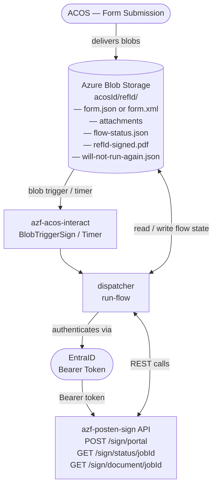
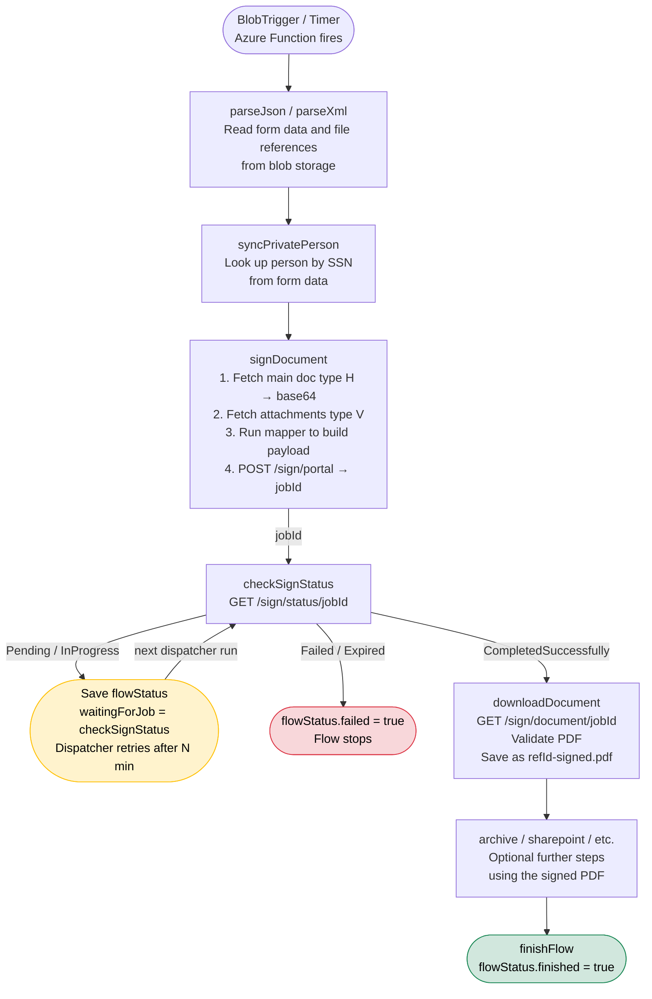
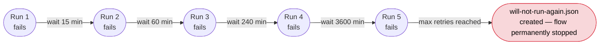

# Document Sign Flow

A walkthrough of how azf-acos-interact sends documents for e-signing and handles the signing lifecycle.

---

## Overview

When a form submission arrives from ACOS, the sign flow:

1. Parses the submitted form data
2. Sends the document(s) to a signing service (`azf-posten-sign`)
3. Polls until the user has signed (or the job expires/fails)
4. Downloads the signed PDF and saves it back to blob storage

---

## Architecture



---

## Step-by-step Flow



---

## Retry Behavior

Flow state is persisted in `{refId}-flow-status.json` in blob storage. If a job fails or the sign status is not yet ready, the dispatcher retries on the next run.



Intervals are configured via the `RETRY_INTERVALS_MINUTES` environment variable (comma-separated). The `checkSignStatus` job is treated specially: a non-terminal status (`Pending`, `InProgress`) does **not** count as a failure — it simply pauses the flow and retries on the next dispatcher cycle.

---

## Signing Payload

The flow definition **must** provide a `mapper` function under `signDocument.options`. The mapper receives:

| Argument      | Type     | Description                                        |
|---------------|----------|----------------------------------------------------|
| `flowStatus`  | `Object` | Full current flow state, including parsed form data |
| `base64`      | `String` | Base64-encoded main document (file type `H`)        |
| `attachments` | `Array`  | Array of `{ title, base64, fileType }` for all `V` files |

The mapper must return an object with these required fields:

```js
{
  reference: String,          // unique reference (typically flowStatus.refId)
  documents: [                // at least one document
    {
      title: String,
      base64Content: String,
      fileType: 'pdf'
    }
  ],
  initiatedBy: {
    name: String,
    email: String
  },
  signers: [
    { personalIdentificationNumber: String }  // Norwegian SSN (fødselsnummer)
  ]
}
```

### Example mapper (from `TFK-208-Test signering.js`)

```js
signDocument: {
  enabled: true,
  options: {
    mapper: (flowStatus, base64, attachments) => {
      const person = flowStatus.parseJson.result.SavedValues.Login
      return {
        title: `${flowStatus.acosName} - ${flowStatus.refId}`,
        reference: flowStatus.refId,
        documents: [
          { title: flowStatus.acosName, base64Content: base64, fileType: 'pdf' },
          ...attachments.map(a => ({ title: a.title, base64Content: a.base64, fileType: 'pdf' }))
        ],
        initiatedBy: {
          name: `${person.FirstName} ${person.LastName}`,
          email: person.Email
        },
        signers: [
          { personalIdentificationNumber: person.UserID }
        ]
      }
    }
  }
}
```

---

## Flow Definition — Minimal Example

```js
module.exports = {
  config: { enabled: true },

  parseJson: { enabled: true, options: { mapper: () => ({}) } },

  syncPrivatePerson: {
    enabled: true,
    options: { mapper: (flowStatus) => ({ ssn: flowStatus.parseJson.result.SavedValues.Login.UserID }) }
  },

  signDocument: {
    enabled: true,
    options: { mapper: (flowStatus, base64, attachments) => { /* see above */ } }
  },

  checkSignStatus: { enabled: true },       // no config needed

  downLoadSignDocument: { enabled: true },  // no config needed

  // add archive, sharepointList, etc. here to use the signed PDF in further steps
}
```

---

## Relevant Files

| File | Role |
|------|------|
| [BlobTriggerSign/index.js](BlobTriggerSign/index.js) | Azure Function — fires on new blob, delegates to dispatcher |
| [BlobTriggerSign/function.json](BlobTriggerSign/function.json) | Binding config (container name from env) |
| [lib/dispatcher.js](lib/dispatcher.js) | Finds matching flow for a blob, manages flow state, calls run-flow |
| [lib/run-flow.js](lib/run-flow.js) | Executes each job in sequence, handles `checkSignStatus` polling loop |
| [lib/call-document-sing.js](lib/call-document-sing.js) | HTTP client for the sign API (GET/POST with EntraID Bearer token) |
| [lib/jobs/sign-document.js](lib/jobs/sign-document.js) | Reads blobs, runs mapper, POSTs to `/sign/portal` |
| [lib/jobs/check-sign-status.js](lib/jobs/check-sign-status.js) | GETs `/sign/status/{jobId}` |
| [lib/jobs/download-document.js](lib/jobs/download-document.js) | GETs `/sign/document/{jobId}`, validates PDF, saves to blob |
| [flows/TFK-208-Test signering.js](flows/TFK-208-Test%20signering.js) | Example flow definition using the sign jobs |

---

## Environment Variables

| Variable | Description |
|----------|-------------|
| `SIGN_URL` | Base URL for the sign API (`azf-posten-sign`) |
| `SIGN_SCOPE` | EntraID scope used to obtain a Bearer token for the sign API |
| `STORAGE_ACCOUNT_CONNECTION_STRING` | Connection string for Azure Blob Storage |
| `STORAGE_ACCOUNT_CONTAINER_NAME` | Blob container where form submissions and flow state live |
| `APP_REG_CLIENT_ID` | EntraID app registration client ID |
| `APP_REG_CLIENT_SECRET` | EntraID app registration client secret |
| `APP_REG_TENANT_ID` | EntraID tenant ID |
| `RETRY_INTERVALS_MINUTES` | Comma-separated retry delays in minutes (default: `15,60,240,3600`) |

---

## Sign Job Status Values

| Status | Meaning | Flow action |
|--------|---------|-------------|
| `Pending` | Job created, user not yet notified | Wait and retry |
| `InProgress` | User has started signing | Wait and retry |
| `CompletedSuccessfully` | All signers have signed | Continue — download the PDF |
| `Failed` | Signing job failed | Mark flow as failed, stop |
| `Expired` | Job timed out before signing completed | Mark flow as failed, stop |
